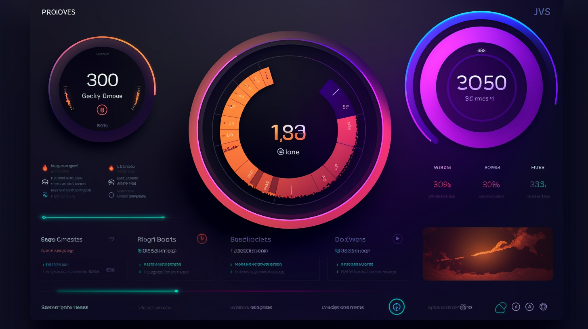

## Mood Magnet 🧲
Media sentiment made simple:  Harnessing market sentiment for Financial Forecasting.

# 📈 Financial Sentiment Analysis: Decoding the Impact of News and Social Media Sentiment on Stock Market 📰💬

Welcome to **"Mood Magnet"**, our thrilling project that navigates the intersection of financial sentiment, news, social media, and the stock market! We'll leverage the power of machine learning and natural language processing (NLP) to understand how the sentiment from news articles and social media posts influences stock market movements.

Our goal? To create an investment tool focused on trends with real-time sentiment analysis, aiming for reliably accurate predictions on markets' feelings toward companies' products/services. We will train our model on sentiment data, including financial news and social media posts, and correlate it with stocks' closing prices. 🚀

***"The first and simplest emotion which we discover in the human mind is curiosity." – Edmund Burke***

Let's satisfy that curiosity and get cracking! 🕵️‍♂️🔎

## 📋 Project Proposal and Outline
### 🎯 Title
Financial Sentiment Analysis: Impact of News and Social Media Sentiment on Stock Market

# 🎯 Target Market:
Our product is for the people - retail investors aged between 18-45. Given the rising trend of retail investment, we believe our tool could provide crucial insight to these new market entrants.
# 📈 The Rise Of The Retail Investor:
A new wave of investors is looking to make an impact on the market, and we are capitalizing on this need for affordable, accessible tools. With Mood Magnet, we're hoping to increase confidence in retail investors' strategies, making their entrance into the stock market more educated and informed.
# 💡 Value:
Mood Magnet is a simple to use investing tool, at an affordable monthly price point, payable in fiat currency, BTC and ETH. The future of the markets is entering the hands of the people willing to risk it for the biscuit. Better tools lead to better results. The retail revolution is now!

# 🗂️ Data
We'll gather financial news articles and social media posts related to the stock market from various sources, such as:

- APIs of financial news websites
- Twitter API for collecting tweets
- Stock market price data from Yahoo Finance or similar sources
## 🤖 Machine Learning Models
We plan to explore NLP techniques like BERT and LSTM for sentiment analysis. For predicting stock market movements based on the extracted sentiment, we might consider traditional machine learning models like Random Forest or Gradient Boosting.

### 🛠️ Data Preparation
- **Data Collection:** Harness APIs to collect financial news articles and tweets related to the stock market. Simultaneously, collect stock market price data for the same time period.
- **Data Cleaning:** Scrub the text data by removing unwanted characters, URLs, stop words, and apply lower casing.
- **Data Labeling:** Depending on the availability of labeled data, we might need to manually label the sentiment of news articles and tweets, or use a pre-trained sentiment analysis model to label the data.
## 🎓 Model Training and Evaluation
- **Model Selection:** Choose and implement NLP models (BERT, LSTM), and traditional ML models if required.
- **Model Evaluation:** Assess the performance of the models on the testing dataset. We'll use suitable metrics like accuracy, precision, recall, F1-score for sentiment analysis, and Mean Absolute Error, Mean Squared Error, R2 score for stock price prediction.
## 🎯 Predictions and Conclusions
- **Interpretation:** Interpret the results and derive conclusions about the impact of news and social media sentiment on stock market movements.
- **Future Predictions:** Use the trained model to make predictions on new, unseen data.
## 📊 Presentation and Submission
- Presentation: Prepare a presentation to articulate your project, methodology, and findings. Be sure to include visualizations and metrics to support your points.
- Submission: Submit your project, which includes all code, visualizations, and a README summarizing your project and explaining how to use your model.

# 🎉 Get Involved!
Join us in this ambitious endeavor to untangle the intricate web of sentiment, social media, news, and stock market movements. Together, we'll shed light on how these dimensions interplay and influence each other. So, ready to explore and learn? Let's dive in! 🏊‍♂️🌊

Get ready for a thrilling data journey! 🧳🗺️